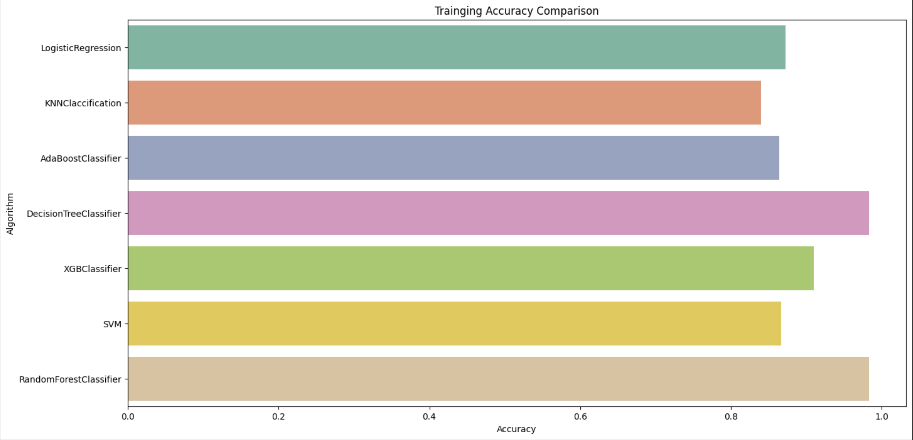
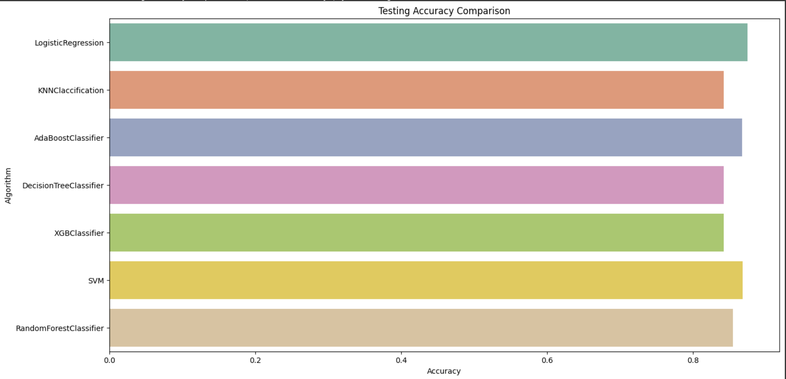

# ❤️ Heart Disease Prediction using Machine Learning

This project aims to predict the likelihood of heart disease based on various health-related features using multiple machine learning algorithms. The dataset was imbalanced, so preprocessing, undersampling, feature selection, scaling, and PCA were used before model training. The final model was deployed using **Gradio** for interactive usage.

---

## 🔍 Project Overview

### Key Objectives:
- Handle imbalanced data through **undersampling**
- Apply **feature scaling** and **PCA**
- Explore data through **EDA**
- Train and evaluate various ML algorithms
- Use metrics like **Accuracy, Confusion Matrix, Classification Report, ROC Curve**
- Select the best model (**Random Forest**) and deploy with **Gradio**

---

## 📊 Dataset

- The dataset contains various health indicators such as:
  - BMI, PhysicalHealth, MentalHealth, SleepTime, etc.
  - Target label: `HeartDisease` (binary classification)

---

## 🛠️ Preprocessing Steps

1. **Handling Imbalance:**
   - The dataset was **imbalanced** toward one class.
   - We used **undersampling** to balance the classes.

2. **Feature Selection:**
   - Used `SelectKBest` to rank features by importance.
   - Top features include `DiffWalking`, `PhysicalHealth`, `Diabetic`, etc.

3. **Feature Scaling:**
   - Applied `StandardScaler` to normalize the features.

4. **Dimensionality Reduction:**
   - **PCA (Principal Component Analysis)** was used to reduce feature space.

5. **Exploratory Data Analysis (EDA):**
   - Visualizations used to understand class distribution and correlations.
   - Bar plots for feature importance and class comparisons.

---

## 🤖 Machine Learning Models Used

- Logistic Regression
- K-Nearest Neighbors (KNN)
- AdaBoost Classifier
- Decision Tree Classifier
- XGBoost Classifier
- Support Vector Machine (SVM)
- Random Forest Classifier

---

## ✅ Evaluation Metrics

For each algorithm, we evaluated:

- **Accuracy**
- **Confusion Matrix**
- **Classification Report**
- **ROC Curve**

📌 **Random Forest** yielded the best balance between precision, recall, and accuracy.

---
## 📊 Comparative Analysis of Algorithm Accuracy

### ✅ Training Accuracy

### ✅ Testing Accuracy

---

## 🚀 Deployment

- The final **Random Forest** model was deployed using **Gradio**.
- It provides a simple web UI where users can input health features to get predictions.
